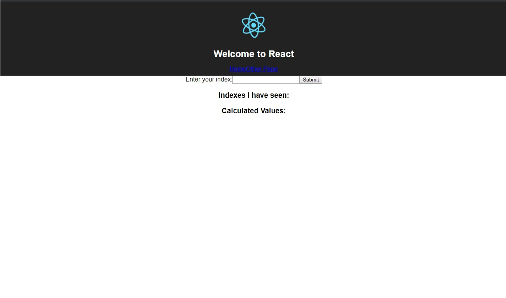

#Project-9 Multi-Container Application

## Overview/Description
This project demonstrates the development of a multi-container application with the following components:
- **Nginx**: Acts as a reverse proxy and load balancer.
- **React**: Provides the front-end of the application.
- **Express**: The back-end server that provides APIs.
- **Redis**: A caching server for fast, in-memory data storage.
- **PostgreSQL**: The relational database used to store data.
- **Worker Service**: A service to calculate values and interact with the Redis and PostgreSQL databases.

### Development Flow:
1. **Browser** connects to the **Nginx** server.
2. **Nginx** routes the request to the **React** server for front-end content.
3. **Nginx** also connects to the **Express** server for handling API requests.
4. **Express** communicates with the **Redis DB** for caching.
5. **Express** also interacts with the **PostgreSQL** database to retrieve or store calculated values.
6. The **Worker Service** is used to perform calculations and update Redis/Postgres as necessary.


## Development Flow:
1. Browser connects to Nginx server.
1. Nginx Server connects to React Server.
    - For front-end content.
1. Ngnix Server connects to Express Server.
    - For APIs.
1. Express Server will connect to Redis DB.
    1. Redis Server will connect to Worker Service to calculate value.
1. Express Server will connect to Postgres.
    - To retrive already calculated values.

## Running containers locally
*Before runnning container locally please make sure you have changed the $(pwd) in **docker-compose.yml** to suit your current working directory.*
```
docker-compose up
```

## The Application



Clone this  GitHub repository (`https://github.com/HQ786/devops-portfolio/project-9-multi-container-application`) for the relevant project.

